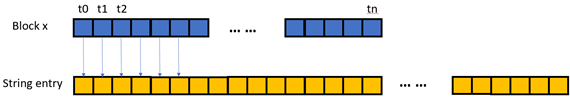
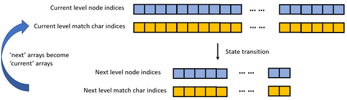

# regex-gpu
This project mainly focus on the design and implementation of string-per-block kernel in regular expression matching.

## Compile and Run
The user can either use the makefile in the main directory or use VS2019 to compile and run the project.

## Introduction
In this project, we are interested in the regular expression matching kernels which make use of a whole thread block to deal with one string entry in the log input file. 

One common feature of the block kernel is that the way to coordinate between threads are through shared memory and the __syncthreads() block barriers. Thus, using warp-level work sharing is preferable than the block-level work sharing when the threads are trying to cooperate on the same amount of work. 
Another property of the block kernel is about parallelism. The string per block kernel naturally has a lot of parallelism both within the grid and within one block. However, in most cases, parallelism starts large and shrink dramatically and only a few threads in a few blocks have work to do when the going deeper into the BFS tree. Thus, the whole thread block will need to wait for the last thread to finish during the execution of string entry.

Basically, for the string per block case, we adopted 3 optimization techniques in addition to the plane baseline kernel with tuned parameters. To be more specific, shared memory storage, block-level queue and block-level coarsening are used. These techniques either have positive effects on the kernel performance or is interesting for the purpose of discussion.

###	Basic kernel
In the basic implementation, we simply use one thread to handle one start point of the string entry and perform computation of traditional NFA regex matching based on BFS. When the number of starting points exceeds the number of threads, we divide the string entry by chunks and let the thread block loop through the whole string entry step by step. We can reduce the potential load imbalance by assigning neighboring threads to neighboring starting points since lower-indexed threads have a potentially bigger search space than the higher ones.  Both the log string data and the NFA data are put into the global memory. The diagram to illustrate of how the threads are mapped to the string data is shown below.
 
 

To sum up the basic string per block kernel, the first intuition is that we have enough thread blocks to keep the streaming multiprocessor busy. Blocks explore string entries in parallel within the grid and threads explore starting positions in parallel within one block. Another intuition is that if we put either the string entry data (char arrays) or the NFA data (struct of multiple arrays of different types) into shared memory, we can gain a lot of efficiency from data reuse.

###	Basic kernel with shared memory
Utilizing shared memory is quite a natural thought for the implementation of the string per block kernel. We could choose to put either the string entry data or the NFA data or both into the shared memory. However, due to the capacity limit (about 32K bytes on modern GPU) of the shared memory resources, the NFA data will not always be capable of fitting into the shared memory even though the string entry data will be most likely smaller than 32K bytes. A powerful kernel should handle the corner case where the NFA data is too large to completely fit into the shared memory, thus we may choose to solve this in the future by identifying the hot nodes in the NFA and putting them into shared memory and keeping cold ones in the global memory. In this project, we only implemented the versions that either put the whole NFA structure into global memory or put it into the shared memory.

The character array used to store string entry data and the integer, boolean and character arrays used for representing the NFA structure can be loaded into the shared memory collaboratively in a coalesced manner.
###	Basic kernel with block coarsening
This technique is inspired by the thread-coarsening technique in the lecture to improve data reuse. Instead of letting one block to handle one string entry, we now assign multiple string entries to one block. In this way, we can improve the reuse of NFA data in shared memory as well as reduce the pressure on the kernel distributor.

###	Block-queuing kernel
In the basic kernels, we can easily tell that lots of computation resources are wasted, where ‘wasted’ means failing at the start state of the NFA. Most threads in a block are wasted since only a few starting points can step forward to the final state of NFA. The wasted threads have no work to do in the following block execution time. They have to wait for the threads that have more work to do and are able to reach the end state of NFA. Thus, one improvement goal is to let those have no work to do help with the workload of hot threads.

To prevent the string per block kernel degenerate to string per warp kernel and string per thread kernel, we came up with a work sharing queue utilizing shared memory. We call it block queue for its block-level work sharing functionality.
 
  

This block queue utilizes shared memory for work sharing among different threads in a block. Previously, each thread perform its own state transitions and walks through its own frontier from levels to levels. The block queue is aimed for letting all threads cooperate in the work when not all threads has its own assigned frontier to explore. Since the state transition of NFA inherently only depend on the current node and its edges, this kernel uses four shared memory arrays to respectively hold current level node indices, current level match character indices, next level node indices and next level match character indices. The kernel uses the current level arrays to deduce concurrently and generate atomically the next level arrays, which will in turn become the current level arrays in the next iteration. After the block queue is prepared for one iteration, the threads will collaboratively perform the state transition in parallel using the data in the current level nodes and match character indices. At the end of one iteration, the kernel will tell whether any of the generated next level nodes represent the end state of the NFA.

Take a block of 4 threads as an example, after the first iteration, one thread of the four generates 4 next level nodes to transfer to while the other three fail immediately. If neither of these four is the end state, the loop will continue and the all the four threads will be responsible for computation of the next level nodes. In this scenario, unlike letting one threads to process four nodes in the basic kernel, we let four threads to cooperate on this task with one node for each thread.
From the profiling result using Nsight Compute, we find that although the achieved occupancy of block queue kernel is larger than the basic kernel, it’s compute throughput and memory throughput is lower. The high occupancy results from using too much stall barriers to share work across the block.
###	Conclusion on the string-per-block kernels

  

The above figure evaluates the time consumption of different block-level kernels and their comparison with the cudf baseline on one of the dataset. This dataset contains relatively small NFA thus the whole NFA could be pull into the shared memory in addition to the string column. 

The basic kernels are about one time faster than the cudf but the block queue kernel is much slower due to the stall barriers. The fastest kernel is the one that utilize shared memory for both NFA and string column data while employing the block coarsening technique. This is the one that has most reuse, least block barriers and least atomic operations.

## Acknowledgement
The following files are from this repo https://github.com/bigwater/gpunfa-artifact/.

* include/graph_helper.h
* include/NFA.h
* include/NFALoader.h
* include/node.h
* include/pugiconfig.hpp
* include/pugixml.h
* include/vasim_helper.h
* include/src/NFA.cpp
* include/src/NFALoader.cpp
* include/src/pugixml.cpp
* include/src/vasim_helper.cpp
* include/src/graph_helper.cpp
* include/src/node.cpp"

The following file is from this repo https://github.com/NVIDIA/cuda-samples

* include/helper_string.h